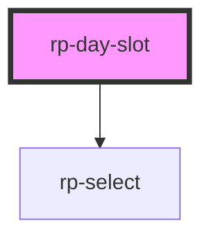

# rp-day-slot

<!-- Auto Generated Below -->

## Overview

One day column of a weekly meal plan.

Meals can be moved by dragging between columns or by choosing a day from the select on
each meal. Both paths emit the same `rpMoveMeal`, so a consumer handles one event and
gets both. The select is not a fallback that could be dropped later — it is the keyboard
and touch path, and dragging is the enhancement layered over it.

## Properties

| Property           | Attribute   | Description                                                                                                                                                                                                    | Type            | Default     |
| ------------------ | ----------- | -------------------------------------------------------------------------------------------------------------------------------------------------------------------------------------------------------------- | --------------- | ----------- |
| `day` _(required)_ | `day`       | Machine-readable day key, echoed in every event. Reflected so a pointer drag can read the target column straight off the element it lands on.                                                                  | `string`        | `undefined` |
| `dayLabel`         | `day-label` | Human-readable day name shown as the column heading.                                                                                                                                                           | `string`        | `''`        |
| `dayLabels`        | --          | Display names for the keys in `days`, as a key-to-label map.  Without this the move control would offer raw keys like "mon". Optional, so a consumer whose keys are already human-readable can leave it unset. | `string`        | `{}`        |
| `days`             | --          | All day keys, used to populate each meal's move target list.                                                                                                                                                   | `string[]`      | `[]`        |
| `meals`            | --          | Meals planned for this day. Must be assigned as a DOM property.                                                                                                                                                | `PlannedMeal[]` | `[]`        |

## Events

| Event          | Description                                                               | Type                                                     |
| -------------- | ------------------------------------------------------------------------- | -------------------------------------------------------- |
| `rpAddMeal`    | Fired when the user asks to add a meal to this day.                       | `CustomEvent<string>`                                    |
| `rpMoveMeal`   | Fired when a meal is reassigned to a different day, by drag or by select. | `CustomEvent<{ id: string; from: string; to: string; }>` |
| `rpRemoveMeal` | Fired when a meal is removed from this day.                               | `CustomEvent<{ id: string; day: string; }>`              |

## Slots

| Slot | Description                                          |
| ---- | ---------------------------------------------------- |
|      | Empty-state content shown when the day has no meals. |

## Dependencies

### Depends on

- [rp-select](../rp-select)

### Graph

----------------------------------------------

*Built with [StencilJS](https://stenciljs.com/)*
