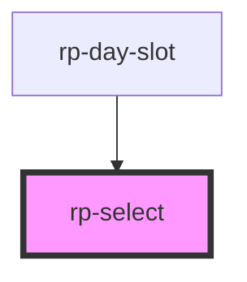

# rp-select

<!-- Auto Generated Below -->

## Overview

A single-select control with a styled option list.

A native `<select>` renders its dropdown as an operating-system panel: square corners, a
blue system highlight, and platform typography. None of that is reachable from CSS —
`option` accepts a colour and a font at best, and the panel itself accepts nothing — so
a native control can never match a designed interface once it is open. On a small screen
the panel also breaks out of any dialog it sits in, because it is not part of the page.

This renders the list as ordinary elements instead, which is what makes it styleable,
and reimplements the keyboard behaviour the native control would have provided:
Up/Down/Home/End to move, Enter or Space to commit, Escape to dismiss, and typing a few
characters to jump. The trigger carries `role="combobox"` and the list `role="listbox"`,
so assistive technology sees the same control it would have seen before.

## Properties

| Property      | Attribute     | Description                                                                                                                                                                                                                     | Type             | Default     |
| ------------- | ------------- | ------------------------------------------------------------------------------------------------------------------------------------------------------------------------------------------------------------------------------- | ---------------- | ----------- |
| `compact`     | `compact`     | Renders a smaller trigger, for a control sitting in a narrow column.  Reflected so the stylesheet can select on it. The list keeps the full type size — it is an overlay and has room even where the trigger does not.          | `boolean`        | `false`     |
| `disabled`    | `disabled`    | Disables the control.                                                                                                                                                                                                           | `boolean`        | `false`     |
| `dropUp`      | `drop-up`     | Set when the list opens upward because there is more room above the trigger.  A prop rather than internal state so it reflects to an attribute the stylesheet can select on; it is written by the component, not by a consumer. | `boolean`        | `false`     |
| `label`       | `label`       | Accessible name, used when no external label is associated.                                                                                                                                                                     | `string`         | `''`        |
| `open`        | `open`        | Whether the list is open. Reflected so a consumer can style the open state.                                                                                                                                                     | `boolean`        | `false`     |
| `options`     | --            | Options to choose from. An array has no attribute form; assign it as a property.                                                                                                                                                | `SelectOption[]` | `[]`        |
| `placeholder` | `placeholder` | Shown on the trigger when nothing is selected.                                                                                                                                                                                  | `string`         | `'Choose…'` |
| `value`       | `value`       | Currently selected value.                                                                                                                                                                                                       | `string`         | `''`        |

## Events

| Event            | Description                   | Type                  |
| ---------------- | ----------------------------- | --------------------- |
| `rpSelectChange` | Fired when a value is chosen. | `CustomEvent<string>` |

## Methods

### `focusControl() => Promise<void>`

Moves focus to the trigger, so a consumer can direct attention here.

#### Returns

Type: `Promise<void>`

## Dependencies

### Used by

 - [rp-day-slot](../rp-day-slot)

### Graph

----------------------------------------------

*Built with [StencilJS](https://stenciljs.com/)*
